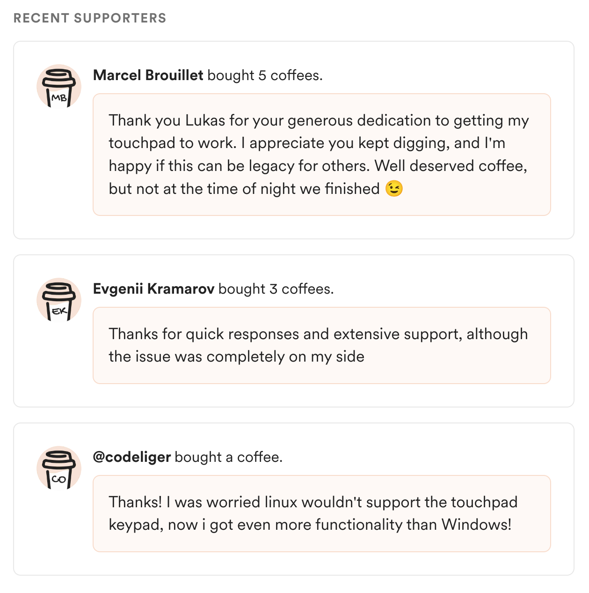

# Asus touchpad DialPad driver

[](https://www.gnu.org/licenses/old-licenses/gpl-2.0.en.html)

[](https://github.com/asus-linux-drivers/asus-dialpad-driver/graphs/contributors)
[](https://github.com/asus-linux-drivers/asus-dialpad-driver/releases)
[](https://GitHub.com/asus-linux-drivers/asus-dialpad-driver/commit/)
[](https://GitHub.com/asus-linux-drivers/asus-dialpad-driver/issues?q=is%3Aissue+is%3Aclosed)
[](https://github.com/asus-linux-drivers/asus-dialpad-driver/compare)
[](https://github.com/asus-linux-drivers/asus-dialpad-driver/issues/new/choose)
[](http://makeapullrequest.com)
[](https://hits.seeyoufarm.com)
--
[](https://github.com/asus-linux-drivers/asus-dialpad-driver#installation)

The driver is written in python and does not necessarily run as a systemd service ([How to start DialPad without systemd service?](#faq)). It contains the common DialPad layouts, you can pick up the right one during the install process. Default settings aim to be the most convenient for the majority. All possible customizations can be found [here](#configuration).

If you find this project useful, please do not forget to give it a [](https://github.com/asus-linux-drivers/asus-dialpad-driver/stargazers) People already did!

## Changelog

[CHANGELOG.md](CHANGELOG.md)

## Frequently Asked Questions

[FAQ](#faq)

## Data collecting

- Driver during installation collects anonymously data with goal improve the driver (e.g. automatic layout detection; data are publicly available [here](https://lookerstudio.google.com/reporting/a9ed8ed9-a0d7-42bd-96e9-57daed8697b1), you can provide used config using `$ bash install_config_send_anonymous_report.sh`)

## Installation

Get the latest dev version using `git`:

```bash
$ git clone https://github.com/asus-linux-drivers/asus-dialpad-driver
$ cd asus-dialpad-driver
$ bash install.sh
```

or customized install:

```
# ENV VARS (with the defaults)
INSTALL_DIR_PATH="/usr/share/asus-dialpad-driver"
LOGS_DIR_PATH="/var/log/asus-dialpad-driver" # only for install and uninstall logs
SERVICE_INSTALL_DIR_PATH="/usr/lib/systemd/user"
INSTALL_UDEV_DIR_PATH="/usr/lib/udev"

# e.g. for BazziteOS (https://github.com/asus-linux-drivers/asus-numberpad-driver/issues/198)
$ INSTALL_DIR_PATH="/home/$USER/.local/share/asus-dialpad-driver"\
INSTALL_UDEV_DIR_PATH="/etc/udev"\
SERVICE_INSTALL_DIR_PATH="/home/$USER/.config/systemd/user/"\
bash install.sh
```

or run separately parts of the install script.

Try found Touchpad with DialPad:

```bash
$ bash install_device_check.sh
```

Add a user to the groups `i2c,input,uinput`:

```bash
$ bash install_user_groups.sh
```

Run driver now and every time that user logs in (do NOT run as `$ sudo`, works via `systemctl --user`):

```bash
$ bash install_service.sh
```

or for NixOS you can use flakes for the installation of this driver.

> [!IMPORTANT]
> In case the layout isn't provided, the "proart16" DialPad layout is used.
> The default value for runtimeDir is `/run/usr/1000/`, for waylandDisplay is `wayland-0` and wayland is `true`.

<details>
<summary>The driver installation (NixOS)</summary>
<br>

This repo contains a Flake that exposes a NixOS Module that manages and offers options for asus-dialpad-driver. To use it, add the flake as an input to your `flake.nix` file and enable the module:

```nix
# flake.nix

{

    inputs = {
        # ---Snip---
        asus-dialpad-driver = {
          url = "github:asus-linux-drivers/asus-dialpad-driver";
          inputs.nixpkgs.follows = "nixpkgs";
        };
        # ---Snip---
    }

    outputs = {nixpkgs, asus-dialpad-driver, ...} @ inputs: {
        nixosConfigurations.HOSTNAME = nixpkgs.lib.nixosSystem {
            specialArgs = { inherit inputs; };
            modules = [
                ./configuration.nix
                asus-dialpad-driver.nixosModules.default
            ];
        };
    }
}
```
Then you can enable the program in your `configuration.nix` file:
```nix
# configuration.nix

{inputs, pkgs, ...}: {
  # ---Snip---
  # Enable Asus DialPad Service
  services.asus-dialpad-driver = {
    enable = true;
    layout = "default";
    wayland = true;
    runtimeDir = "/run/user/1000/";
    waylandDisplay = "wayland-0";
  };
  # ---Snip---
}

```
</details>

## Uninstallation

To uninstall run

```bash
$ bash uninstall.sh

# ENV VARS (with the defaults)
INSTALL_DIR_PATH="/usr/share/asus-dialpad-driver"
LOGS_DIR_PATH="/var/log/asus-dialpad-driver" # only for install and uninstall logs
SERVICE_INSTALL_DIR_PATH="/usr/lib/systemd/user"
INSTALL_UDEV_DIR_PATH="/usr/lib/udev"

# e.g. for BazziteOS (https://github.com/asus-linux-drivers/asus-numberpad-driver/issues/198)
$ INSTALL_DIR_PATH="/home/$USER/.local/share/asus-dialpad-driver"\
INSTALL_UDEV_DIR_PATH="/etc/udev/"\
SERVICE_INSTALL_DIR_PATH="/home/$USER/.config/systemd/user/"\
bash uninstall.sh
```

or run separately parts of the uninstall script

```bash
$ bash uninstall_service.sh
$ bash uninstall_user_groups.sh
```

## Layouts

Layouts below are named by laptop models, but the name is not important. What is important is their visual appearance because they are repeated on multiple laptop models across series. The install script should recognize the correct one automatically for your laptop. If yours was not recognized, please create issue.

| Name | Description                                                                                                  | Image                                                                                               |
| ------------ | ------------------------------------------------------------------------------------------------------------ | --------------------------------------------------------------------------------------------------- |
| <a id="asusvivobook16x"></a><br><br><br><br><br>asusvivobook16x<br><br><br><br><br><br><br> | not nested                                                                |                                              |
| <a id="proartp16"></a><br><br><br><br><br>proartp16<br><br><br><br><br><br><br> | nested                                                               |                                              |


### FAQ ###

**How to start dialpad without systemd service?**

- layout name is required as first argument and as second argument can be optionally passed path to directory where will be autocreated config `dialpad_dev` (default is current working directory):

```
/usr/share/asus-dialpad-driver/.env/bin/python3 /usr/share/asus-dialpad-driver/dialpad.py <up5401ea|e210ma|..>
```

**How to install the driver when is used pyenv for managing multiple Python versions?**

```
$ git clone https://github.com/asus-linux-drivers/asus-dialpad-driver
$ cd asus-dialpad-driver

$ # pyenv install Ubuntu 22.04
$ apt install -y make build-essential libssl-dev zlib1g-dev libbz2-dev libreadline-dev libsqlite3-dev wget curl llvm libncurses5-dev libncursesw5-dev xz-utils tk-dev libffi-dev liblzma-dev python3-openssl git
$ curl https://pyenv.run | bash

# install & change to the Python version for which one do you want to install the driver
$ CC=clang pyenv install 3.9.4
$ pyenv global 3.9.4 # change as global
$ # pyenv local 3.9.4 # will create file .python-version inside source dir so next (re)install will be used automatically saved Python version in this file

# install the driver
$ bash install.sh

# change to the standardly (previously) used Python version
$ pyenv global system
```

**How can DialPad be activated via CLI?**

- directly just change `enabled` in the appropriate lines of the config file:

```
# enabling DialPad via command line
sed -i "s/enabled = 0/enabled = 1/g" dialpad_dev
sed -i "s/enabled = 0/enabled = 1/g" /usr/share/asus-dialpad-driver/dialpad_dev
# disabling
sed -i "s/enabled = 1/enabled = 0/g" dialpad_dev
sed -i "s/enabled = 1/enabled = 0/g" /usr/share/asus-dialpad-driver/dialpad_dev
```

## Configuration

### Keyboard layout

During the install process `bash ./install.sh`, you're required to select your keyboard layout:

```
...
1) asusvivobook16x.py
2) proartp16.py
9) Quit
Please enter your choice
...
```

| Option                                        | Required | Default           | Description |
| --------------------------------------------- | -------- | ----------------- | ----------------------------------------------------------------------------------------------------------------------------------------------------------------------------------------------------------------------------------------------------------------------------------------------------------------------------------------------------------------------------------------------------------------------------------------------------------------------------------------------------------------------------------------------------------------------------------------------------------------------------------------------------------------------------------------------------------------------------------------------------------------- |
| **Position of DialPad**                                |          |
| `circle_diameter`                                        | Required |                   | in px
| `center_button_diameter`                                        | Required |                   | in px
| `circle_center_x`                                        | Required |                   | in px
| `circle_center_y`                                        | Required |                   | in px
| **Associated apps**                                |          |          |
| `app_shortcuts`                                        | Optional | Yes                  | | required format like in `default` layout

### Configuration file

Attributes which do not depend on a specific Dialpad keyboard can be changed according to the table below in the config `dialpad_dev` in the installed driver location `/usr/share/asus-dialpad-driver`. See the example below showing the default attibutes:

```
[main]
disable_due_inactivity_time = 0
touchpad_disables_dialpad = 1
activation_time = 1
enabled = 0
```

| Option                                        | Required | Default           | Description |
| --------------------------------------------- | -------- | ----------------- | ----------------------------------------------------------------------------------------------------------------------------------------------------------------------------------------------------------------------------------------------------------------------------------------------------------------------------------------------------------------------------------------------------------------------------------------------------------------------------------------------------------------------------------------------------------------------------------------------------------------------------------------------------------------------------------------------------------------------------------------------------------------- |
| **System**                                    |          |                   |
| `enabled`                                     |          | `0`               | DialPad running status (enabled/disabled)
| `disable_due_inactivity_time`                 |          | `0` [s]            | DialPad is automatically disabled when no event received for this interval<br><br>decimal numbers allowed (e.g. `60.0` [s] is one minute, `0` set up by default disables this functionality)
| `touchpad_disables_dialpad`                    |          | `1`            | when Touchpad is disabled DialPad is disabled aswell
| **Layout**                                |          |
| `slices_count`              |          | `1.0` [seconds]             | number of slices in the circle considered as steps when moving with finger around
| `suppress_app_specifics_shortcuts`              |          | `0`             | app specific shortcuts are ignored when is specific window with app opened
| **Top right icon**                            |          |                   |
| `activation_time`              |          | `1.0` [seconds]             | amount of time you have to hold `top_right_icon`

## Similar existing

- I do not know any

## Existing related projects

- [c] Set of tools for handling ASUS Dial and simmilar designware hardware under Linux (https://github.com/fredaime/openwheel)

**Why was this project created?** Because linux does not support integration of DialPad into a Touchpad

**Stargazer evolution for the project**

[](https://starchart.cc/asus-linux-drivers/asus-dialpad-driver)

**Buy me a coffee**

Do you think my effort put into open source is useful for you / others? Please put a star in the GitHub repository. Every star makes me proud. Any contribution is also welcome. Would you like to reward me more? There now exists a way : you can invite me for a coffee! I would really appreciate that!

For this [ko-fi.com/ldrahnik](https://ko-fi.com/ldrahnik) is preferred instead of [buymeacoffee.com/ldrahnik](https://buymeacoffee.com/ldrahnik) because of zero commissions.

[](https://ko-fi.com/ldrahnik)

[](https://ko-fi.com/ldrahnik)

[](https://buymeacoffee.com/ldrahnik)
